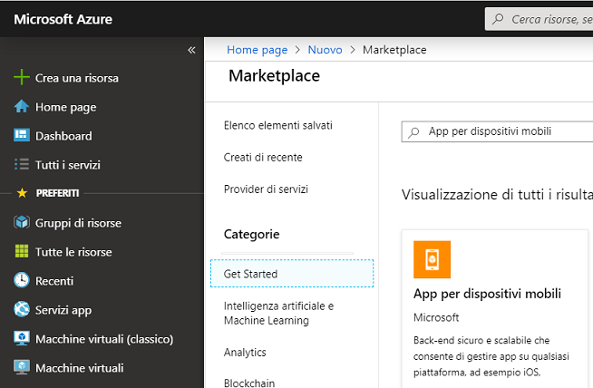
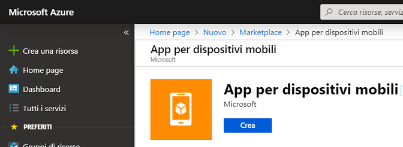
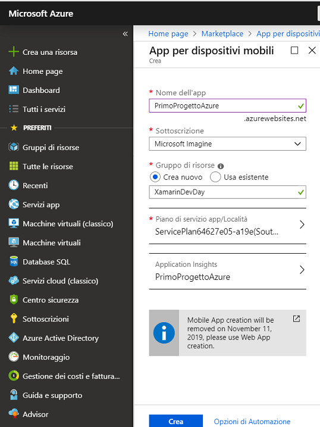
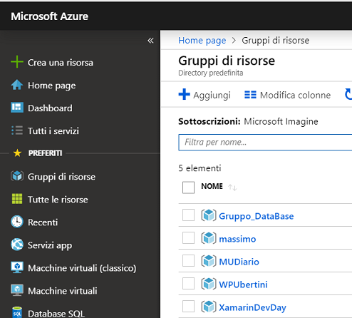
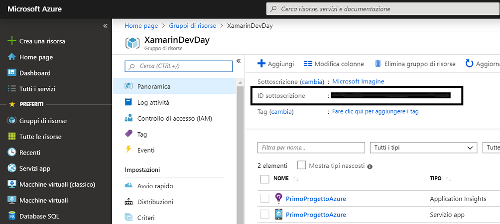
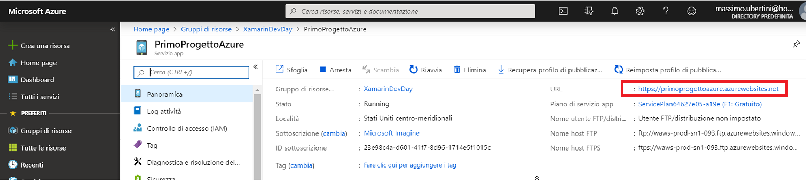
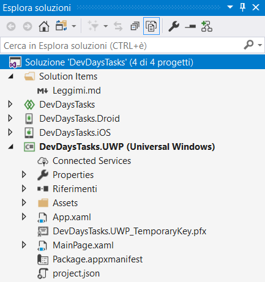
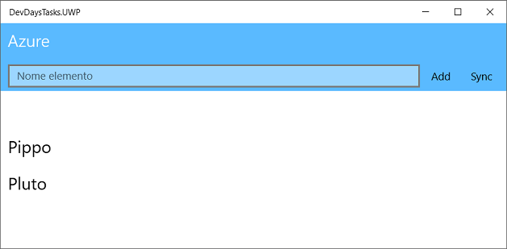

---

---

# Azure Tasks

Progetto che mostra come aggiungere facilmente back-end usando le app per dispositivi mobili di Azure ad un'app Xamarin.

## Installazione

Configurazione app.

##### Azure Account

Iscriversi o accedere all'account Azure all'indirizzo [seguente](http://www.azure.com).

##### Accedere al portale di Azure

Indirizzo [seguente](http://portal.azure.com)

##### Creare una nuova app per dispositivi mobili di Azure

Fare clic su ***+ Crea una risorsa.***

Ricerca ***App per dispositivi mobili***.

Fare clic su ***App per dispositivi mobili***.

Fare cli su ***Crea***.

- Assegnare un nome all'app.
- Selezionare l'abbonamento.
- Creare un nuovo gruppo di risorse denominato ***XamarinDevDays***.
- Aggiungerlo al piano esistente o creare un nuovo piano.
- Fare clic su ***Crea***.

Azure configura l'app.

Fare cli su ***Gruppi di risorse***.

Fare clic su ***XamarinDevDays***.

Fare clic su ***PrimoProgettoAzure***.

Copiare l'URL ed inserirla nel progetto *DevDaysTasks/Helpers/Constants.cs*.

## Creare una soluzione

 Per prima cosa, si creerà una soluzione Xamarin.Forms. Il tipo di soluzione include fin dall'inizio tutti i file modello necessari.

1. Aprire Visual Studio 2019.
2. Nella finestra iniziale scegliere ***Crea un nuovo progetto***.
3. Nella finestra ***Crea un nuovo progetto*** immettere o digitare *console* nella casella di ricerca. Scegliere quindi **C#**  dall'elenco ***Linguaggio*** e ***Windows*** dall'elenco ***Piattaforma***.

Dopo aver applicato i filtri di linguaggio e piattaforma, scegliere il modello ***App per dispositivi mobili (Xamarin.Forms)* ** e quindi scegliere ***Avanti***.

4. Nella finestra ***Configura il nuovo progetto*** digitare o immettere *Primo_Progetto_Azure* nella casella ***Nome del progetto***. Scegliere ***Crea***.

5. Nella finestra ***New Cross Platform App - Primo_Progetto_Xamarin*** verificare che ***Piattaforma*** verificare che siano selezionati ***Android***, ***iOS*** e ***Windows (UWP)***: Infine scegliere ***OK***.

##### Creare l'app

Il template crea una soluzione (SLN) composta da quattro progetti (CSPROJ), ognuno dei quali partecipa al processo di build generando un eseguibile (EXE) o una libreria (DLL).

La portabilità della soluzione è garantita dalla condivisione dello stesso engine di compilazione MSBUILD tra i diversi IDE.

 A questo punto è possibile compilare, distribuire e avviare l'app Xamarin.Forms per verificarne l'aspetto.

1. Nella barra degli strumenti di Visual Studio fare clic con il pulsante destro del mouse sul progetto e selezionare ***Imposta come progetto di avvio***.
2. Fare clic sulla voce di menu ***Debug/Avvia debug (F5)***  o il pulsante di riproduzione (include il testo ***Computer local*e**) per avviare l'app nel PC locale.

